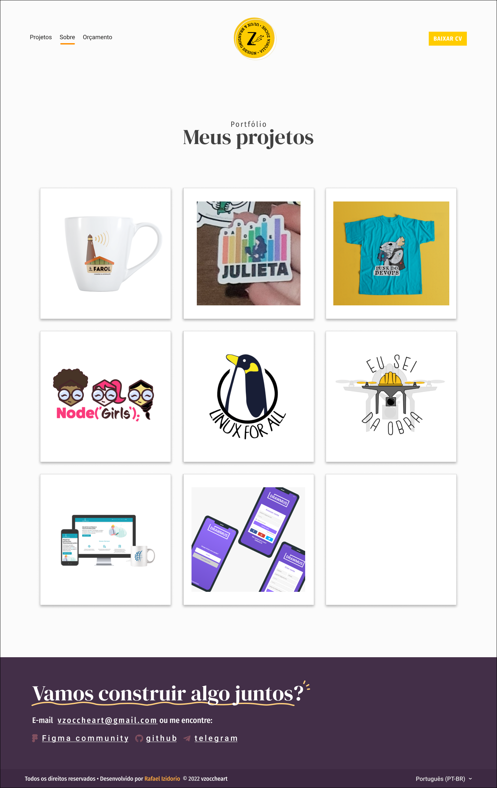
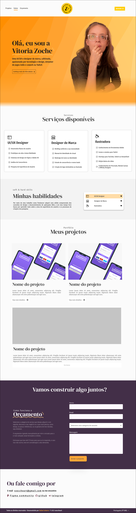
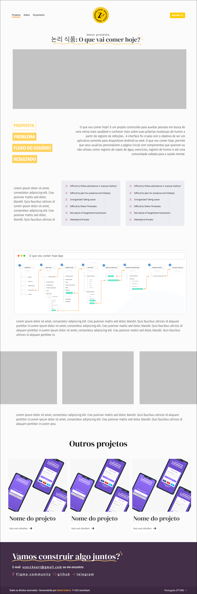
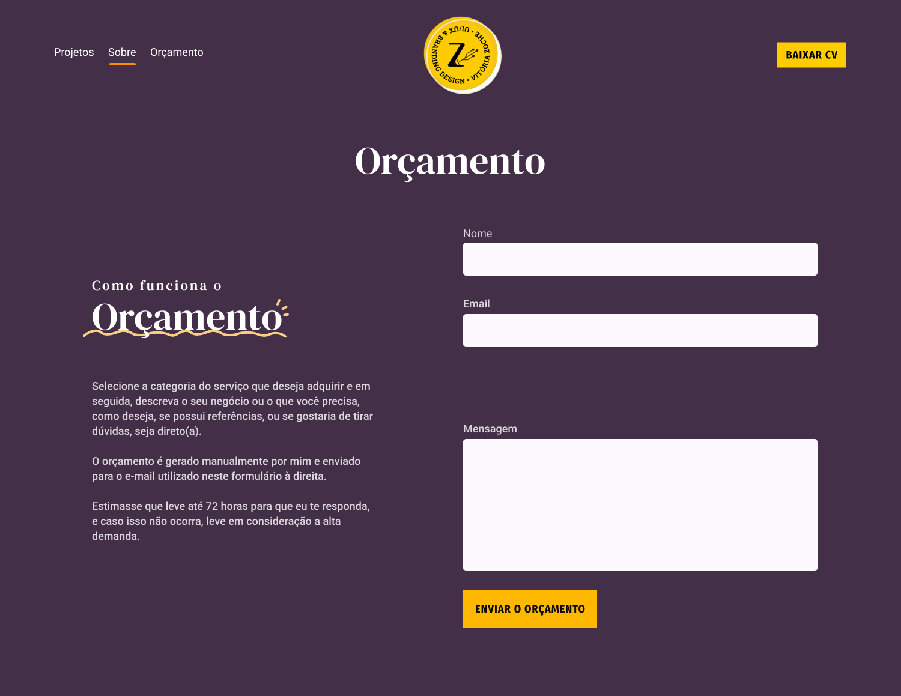

Acesse em 👉 [vitoriazoche.github.io](https://vitoriazoche.github.io)

Está chegando agora? Este ano estou com uma proposta diferente, depois de muito tentar criar um site pra mim, contratei um web designer pra me auxiliar no processo de criação de interface e desenvolve-lo 100% pra mim. O nome dele é [Rafael Izidoro](https://www.behance.net/rafaelizidc79e) e ele possui uma vasta experiência na área, se quiser fazer um app ou site, recomendo de todo o coração o conteúdo dele ♥!

Este é um repositório público, até que talvez não seja mais. no meu novo site haverão os serviços de: orçamento, portfólio, contato e um sobre mim beeem bacana. Veja abaixo alguma das imagens das telas que vamos programar durante o mês de novembro e dezembro:

E todas essas páginas poderão ser vistas e lidas também em inglês, ou pelo menos essa é a ideia mais par o final.

O design será elaborado inicialmente somente para desktop, e talvez acabe como responsivo (vai saber). Estaremos utilizando o Bulma CSS como biblioteca de estilo, mas também haverá estilos desenvolvidos na mão. Preparem-se!

Se alguém ver isso, e quiser ajudar a colocar ele responsivo é só me chamar no [Telegram](https://t.me/vitoriazp) ♥!